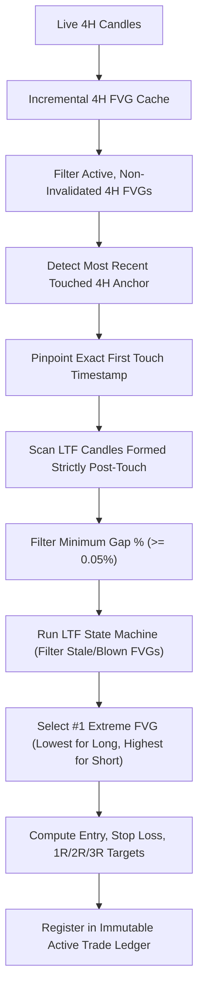

# 📖 Comprehensive Strategy Documentation

This document provides complete architectural, mathematical, and algorithmic specifications for the two trading strategies implemented in this repository.

---

## 📑 Table of Contents
1. [Core Concepts: Fair Value Gaps (FVG)](#-core-concepts-fair-value-gaps-fvg)
2. [Strategy 1: 2-Stage Standard Multi-Timeframe FVG](#-strategy-1-2-stage-standard-multi-timeframe-fvg)
   - [Overview & Workflow](#strategy-1-overview--workflow)
   - [4H HTF Selection Modes](#4h-htf-selection-modes)
   - [Invalidation Rules (Wick vs Close)](#invalidation-rules-wick-vs-close)
   - [Trade Tracker Lifecycle](#strategy-1-trade-tracker-lifecycle)
3. [Strategy 2: ⚡ Extreme LTF FVG Strategy](#-strategy-2--extreme-ltf-fvg-strategy)
   - [Overview & Architecture](#strategy-2-overview--architecture)
   - [Step 1: Incremental 4H FVG Cache](#step-1-incremental-4h-fvg-cache)
   - [Step 2: 4H Anchor Selection & First Touch Pinpointing](#step-2-4h-anchor-selection--first-touch-pinpointing)
   - [Step 3: Post-Touch LTF FVG Discovery](#step-3-post-touch-ltf-fvg-discovery)
   - [Step 4: Extreme Ranking & Selection](#step-4-extreme-ranking--selection)
   - [Step 5: Exact Execution Parameters (Entry, SL, Targets)](#step-5-exact-execution-parameters-entry-sl-targets)
   - [Step 6: Immutable Active Trade Ledger & Lifecycle State Machine](#step-6-immutable-active-trade-ledger--lifecycle-state-machine)
4. [Backtesting Engines & Validation](#-backtesting-engines--validation)
5. [System Architecture & Resilience](#-system-architecture--resilience)

---

## 🧩 Core Concepts: Fair Value Gaps (FVG)

A Fair Value Gap occurs during an energetic market imbalance across a 3-candle rolling sequence `[c1, c2, c3]` (`c1` oldest, `c2` middle impulse, `c3` newest):

```
         BULLISH FVG                                  BEARISH FVG
    c1        c2         c3                      c1        c2         c3
             [  ]                               ===       [  ]
             [  ]                                |        [  ]
   ===       [  ]                                |        [  ]       ===
    |        [  ]        |                       |        [  ]        |
    |        [  ]       ===                    [   ]      [  ]        |
  [   ]      [  ]        |                     [   ]      [  ]      [   ]
  [   ]      [  ]      [   ]                   [   ]      [  ]      [   ]
              ||       [   ]                    ||         ||        ||
              ||        ||                      ||                   ||
```

### Mathematical Definitions:
* **Bullish FVG**: `c3.low > c1.high`
  * **Top boundary**: `c3.low`
  * **Bottom boundary**: `c1.high`
  * **Gap Width**: `c3.low - c1.high`
  * **Midpoint**: `(c3.low + c1.high) / 2`
  * **Gap %**: `(Gap Width / Midpoint) * 100`

* **Bearish FVG**: `c3.high < c1.low`
  * **Top boundary**: `c1.low`
  * **Bottom boundary**: `c3.high`
  * **Gap Width**: `c1.low - c3.high`
  * **Midpoint**: `(c1.low + c3.high) / 2`
  * **Gap %**: `(Gap Width / Midpoint) * 100`

---

## 🏛️ Strategy 1: 2-Stage Standard Multi-Timeframe FVG

### Strategy 1 Overview & Workflow
Strategy 1 scans for confluence between the Higher Timeframe (4H) and Lower Timeframe (5m/15m).

1. **Stage 1 (4H Macro Anchor)**: Identifies if price is currently inside or recently retraced into an active, non-invalidated 4H FVG zone.
2. **Stage 2 (LTF Micro Confirmation)**: Once inside the 4H zone, checks the LTF (5m/15m) for a matching FVG in the same direction.
3. **Scoring & Ranking**:
   $$\text{Score} = 0.35 \times \text{Tightness}_{\text{4H}} + 0.35 \times \text{Tightness}_{\text{LTF}} + 0.30 \times \text{CenterProximity}$$

### 4H HTF Selection Modes
* **`ANY_VALID`**: Scans all active, non-invalidated 4H FVGs and selects any zone containing current price.
* **`RECENT_FORMED`**: Strictly selects the most recently formed 4H FVG (within the last $N$ candles).
* **`TOUCH_WINDOW`**: Selects 4H FVGs that price touched within a configured retrace window (default: 18 candles).

### Invalidation Rules (Wick vs Close)
* **Wick Invalidation (`USE_CLOSE_BASED_INVALIDATION = False`)**:
  * Bullish FVG is invalidated immediately if subsequent candle `low < fvg.bottom`.
  * Bearish FVG is invalidated immediately if subsequent candle `high > fvg.top`.
* **Close Invalidation (`USE_CLOSE_BASED_INVALIDATION = True`)**:
  * Bullish FVG is invalidated only if subsequent candle **closes** below `fvg.bottom` (`close < fvg.bottom`).
  * Bearish FVG is invalidated only if subsequent candle **closes** above `fvg.top` (`close > fvg.top`).

### Strategy 1 Trade Tracker Lifecycle
* **`PENDING_RETRACE`**: Setup discovered, waiting for price to retrace to the LTF FVG entry.
* **`TRADE_ACTIVE`**: Price fills entry level.
* **`COMPLETED_TP`**: Price reaches target ($2.0R$ default).
* **`STOPPED_OUT`**: Price breaches the 3-candle LTF swing extreme stop-loss level.

---

## ⚡ Strategy 2: ⚡ Extreme LTF FVG Strategy

Strategy 2 is a high-precision day-trading system engineered for crypto perpetuals with strict multi-timeframe isolation and zero lookahead bias.



### Step 1: Incremental 4H FVG Cache
* Operates an incremental $O(1)$ cache per symbol (`HTFFVGCache`).
* On initial bootstrap, scans historical 4H closed bars and caches all valid FVGs.
* On subsequent daemon cycles, only processes new closed delta bars, updating boundary invalidations in real time.

### Step 2: 4H Anchor Selection & First Touch Pinpointing
* Identifies the single **most recent touched 4H FVG**:
  * **Currently Inside**: Priority given to 4H zones containing live market price.
  * **Most Recent Touch**: Highest `most_recent_touch_timestamp`.
* **First Touch Anchor**: Pinpoints the exact timestamp when price **first** penetrated the 4H zone post-close (`first_touch_timestamp`).
* **Strict Rule**: LTF FVG discovery will **ALWAYS start strictly from this First Touch Timestamp**. Any LTF FVG formed prior to this touch is invalid.

### Step 3: Post-Touch LTF FVG Discovery
* Scans closed LTF candles (15m default) whose Candle 3 closed at or after `first_touch_timestamp`.
* Applies **Minimum Gap Filter**: $\text{Gap \%} \ge 0.05\%$ (eliminates negligible sub-tick gaps).
* Runs candidate lifecycle state machine:
  * Discards candidate FVGs if price blew through their stop loss before touching entry (`INVALIDATED`).
  * Discards candidate FVGs that already completed targets or stopped out.
  * Retains candidates in `PENDING_RETRACE` or `TRADE_ACTIVE`.

### Step 4: Extreme Ranking & Selection
From all valid, unmitigated LTF FVGs formed post-touch:
* **Bullish (Long)**: Selects the **Lowest Price FVG** (deepest discount, closest to the 4H anchor support zone).
  $$\text{Selected FVG} = \arg\min_{f \in \text{FVGs}} (f.\text{bottom})$$
* **Bearish (Short)**: Selects the **Highest Price FVG** (highest premium, closest to the 4H anchor resistance zone).
  $$\text{Selected FVG} = \arg\max_{f \in \text{FVGs}} (f.\text{top})$$

### Step 5: Exact Execution Parameters (Entry, SL, Targets)
* **Entry Price**:
  * **Bullish**: Upper boundary of the selected LTF FVG (`ltf_fvg.top`).
  * **Bearish**: Lower boundary of the selected LTF FVG (`ltf_fvg.bottom`).
* **Stop Loss (SL)**:
  * Exact extreme wick across the 3 candles `[c1, c2, c3]` forming the LTF FVG:
  * **Bullish**: $\text{SL} = \min(c_1.\text{low}, c_2.\text{low}, c_3.\text{low})$
  * **Bearish**: $\text{SL} = \max(c_1.\text{high}, c_2.\text{high}, c_3.\text{high})$
* **Risk ($R$)**:
  $$\text{Risk } R = |\text{Entry Price} - \text{Stop Loss}|$$
* **Targets**:
  * **Target 1R**: $\text{Entry} \pm 1.0 \times R$
  * **Primary Target 2R ($\star$)**: $\text{Entry} \pm 2.0 \times R$
  * **Target 3R**: $\text{Entry} \pm 3.0 \times R$

### Step 6: Immutable Active Trade Ledger & Lifecycle State Machine
* **Single Source of Truth (`ExtremeTradeTracker`)**:
  * Persisted in `data/extreme_live_trades.json`.
  * Once a position reaches `TRADE_ACTIVE`, its entry price, stop loss, targets, and FVG anchor are **strictly locked and immutable**.
  * Subsequent scanner cycles update live dynamic metrics (`floating_r`, `mfe_r`, `current_price`) without ever overwriting or recalculating the active trade.
* **Candle Extremes for TP/SL Resolution**:
  * Evaluates post-entry closed candle extremes (`candle.high` and `candle.low` where `timestamp >= entry_timestamp`).
  * If `candle.high >= target_tp` (Bullish) or `candle.low <= target_tp` (Bearish) $\rightarrow$ `COMPLETED_TP` ($+2.0R$), moves to history, and frees the symbol for the next setup.
  * If `candle.low <= stop_loss` (Bullish) or `candle.high >= stop_loss` (Bearish) $\rightarrow$ `STOPPED_OUT` ($-1.0R$).

---

## 🔬 Backtesting Engines & Validation

Both strategies feature backtesting modules with chronological candle simulation:

* **Strategy 1 Backtester (`backtest.py`)**:
  * Multi-symbol batch simulation over user-defined date ranges.
  * Win-rate, Net $R$, profit factor, and max drawdown.
* **Strategy 2 Extreme Backtester (`backtest_extreme_fvg.py`)**:
  * 1R, 2R, and 3R target resolution matrices.
  * Duration in minutes, Maximum Favorable Excursion (MFE), and chronological trade inspection.
  * Interactive TradingView chart generator showing entry-to-exit lifecycle.

---

## 🛡️ System Architecture & Resilience

1. **Hyperliquid Async Client (`hyperliquid_client.py`)**:
   * Token Bucket rate limiter (120 req/min).
   * Automatic 429 exponential cooldown coordinator with jitter.
   * Binance Kline API fallback for extended historical lookbacks.
   * Fast-fail on unsupported HIP-1 commodity pairs (`WTIOIL`, `SILVER`).
2. **Telegram Bot Dispatcher (`telegram_client.py`)**:
   * Multi-attempt retry loop with exponential backoff (`1s, 2s, 4s`).
   * High-resolution matplotlib candlestick chart attachments.
   * Auto-fallback to text formatting if photo upload is rate-limited.
3. **Interactive TradingView Chart Generator (`chart_generator.py`)**:
   * High-contrast dark theme (#0b0f19).
   * Dynamic auto-scaled Y-axis with 4H Anchor visual box (or pill if off-chart).
   * Exact entry marker arrow pointing strictly to the first post-formation touch candle.
