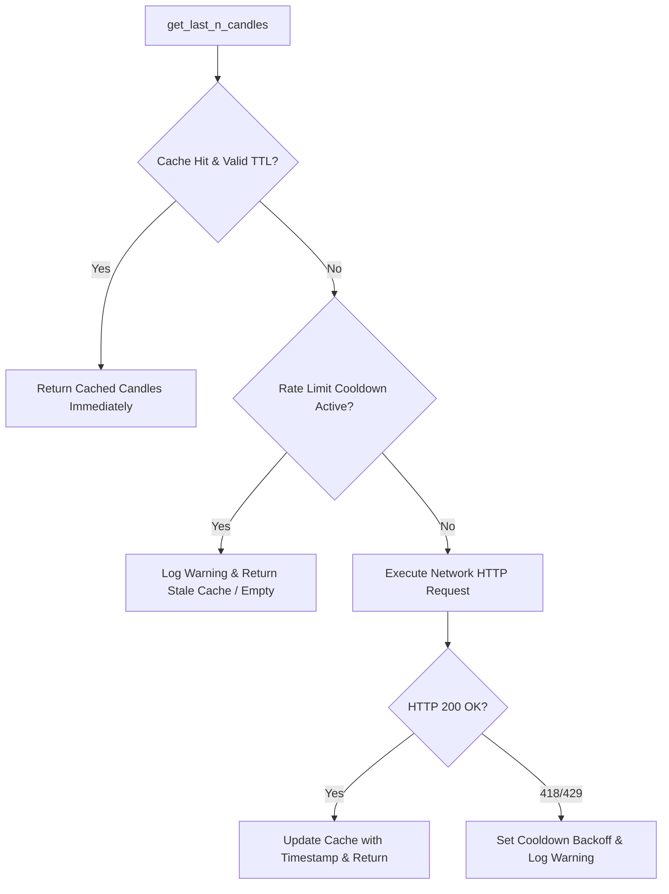

# Technical Design: API Rate Limit Mitigation & In-Memory Market Data Caching

## 1. Cache Architecture in `market_data_provider.py`

## 2. In-Memory Cache Key & Structure
- Cache Entry: `(candles_list, expire_timestamp_ms)`
- Key: `f"{provider_type}:{symbol}:{timeframe}:{limit}"`
- Default TTL:
  - `get_last_n_candles`: 5.0 seconds (configurable via `MARKET_DATA_CACHE_TTL_SECONDS`)
  - `get_all_mids`: 3.0 seconds (configurable via `MARKET_DATA_MIDS_CACHE_TTL_SECONDS`)

## 3. Pipeline Deduplication Flow
In `strategy_extreme_fvg.py`:
- `get_touched_4h_fvg_for_symbol`:
  - Fetch `candles_4h` once.
  - Fetch `candles_ltf` once.
  - Pass `candles_4h` and `candles_ltf` directly into `get_most_recent_touched_4h_fvg` and cache updates.
- `find_active_extreme_setup_for_symbol`:
  - Reuse the `candles_ltf` retrieved during anchor touch evaluation.
