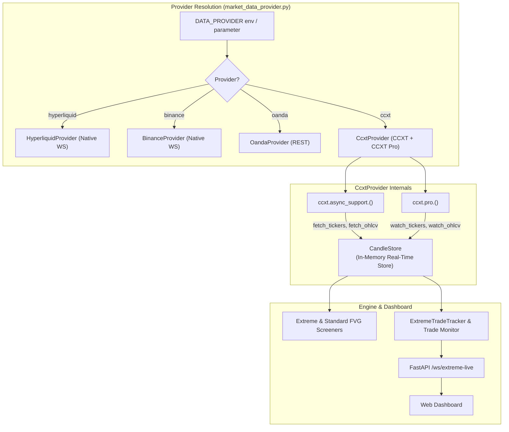

# Design: CCXT & CCXT Pro Unified Market Data Provider

## 1. Architecture Overview

## 2. Technical Invariants & Symbol Normalization

### A. Symbol Resolution
- Incoming user symbols: e.g. `BTC`, `ETH`, `SOL`, `GOLD`, `BTCUSDT`.
- For spot markets: resolved to e.g. `BTC/USDT`.
- For linear swap / perps: resolved to e.g. `BTC/USDT:USDT` or the exchange's specific CCXT market symbol.
- Commodities: `GOLD` / `XAU` mapped to `PAXG/USDT` or `XAU/USDT:USDT` according to exchange availability.

### B. Streaming Lifecycle (`ccxt.pro`)
- When `start_websocket(symbols, timeframes)` is called:
  - Spawns background tasks running `watch_tickers(symbols)` and `watch_ohlcv(symbol, timeframe)`.
  - Parses CCXT ticker dictionaries and merges into `candle_store.set_cached_mids(self.name, mids)`.
  - Parses CCXT OHLCV lists (`[ts, o, h, l, c, v]`) and calls `candle_store.merge_candles(self.name, symbol, tf, candles)`.
- When `stop_websocket()` or `close()` is called:
  - Background streaming tasks are gracefully cancelled.
  - `await exchange.close()` is executed.

### C. Seamless REST Fallback
- If `ccxt.pro` connection drops or WebSocket is disabled, `get_all_mids()` and `get_last_n_candles()` automatically query `ccxt.async_support` REST endpoints (`fetch_tickers`, `fetch_ohlcv`) without throwing exceptions to strategy consumers.
