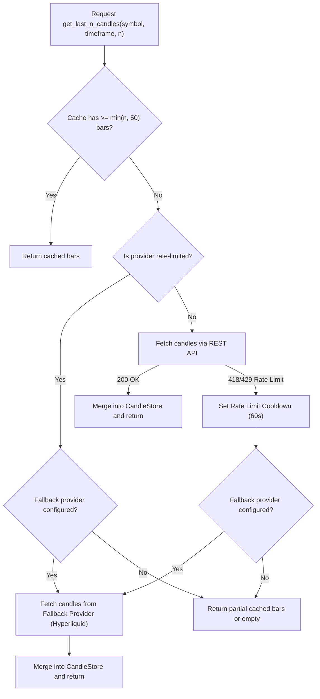

# OpenSpec Design: Fix 4H FVG Detection & Provider Fallback Delegation

## Architecture & Data Flow



## Detailed Component Specifications

### 1. `BinanceProvider` Rate-Limit & Fallback Logic
In `market_data/binance.py`:
- In step 2 (Rate-Limit Guard):
  ```python
  if self._store.is_rate_limited(self.name):
      if cached and len(cached) >= min(n, 50):
          logger.warning("[BinanceProvider] [RATE LIMITED] Serving %d cached bars for %s %s", len(cached), symbol, timeframe)
          return cached
      if self.fallback_provider:
          logger.warning("[ProviderFallback] %s is rate limited with insufficient cache (%d bars) for %s %s -> Delegating to %s",
                         self.name, len(cached) if cached else 0, symbol, timeframe, self.fallback_provider.name)
          fb_candles = await self.fallback_provider.get_last_n_candles(symbol=symbol, timeframe=timeframe, n=n)
          if fb_candles:
              self._store.merge_candles(self.name, symbol, timeframe, fb_candles)
              return fb_candles
      if cached:
          return cached
      return []
  ```
- In step 3 (HTTP 418/429 response handling):
  ```python
  elif resp.status_code in (418, 429):
      self._store.set_rate_limited(self.name, 60.0)
      logger.warning("[BinanceProvider] [HTTP %d] Rate limit hit for %s (%s): %s", resp.status_code, symbol, timeframe, resp.text[:200])
      if cached and len(cached) >= min(n, 50):
          return cached
      if self.fallback_provider:
          logger.warning("[ProviderFallback] %s hit HTTP %d for %s (%s) with insufficient cache -> Delegating to %s",
                         self.name, resp.status_code, symbol, timeframe, self.fallback_provider.name)
          fb_candles = await self.fallback_provider.get_last_n_candles(symbol=symbol, timeframe=timeframe, n=n)
          if fb_candles:
              self._store.merge_candles(self.name, symbol, timeframe, fb_candles)
              return fb_candles
      if cached:
          return cached
      return []
  ```

### 2. `CcxtProvider` Rate-Limit & Fallback Logic
In `market_data/ccxt_provider.py`:
- Mirror the same check in `get_last_n_candles`:
  `if cached and len(cached) >= min(n, 50): return cached` before attempting delegation to `self.fallback_provider`.

### 3. `api_extreme_4h_fvgs` Endpoint Normalization
In `api/extreme.py`:
- Call `raw_4h = await provider.get_last_n_candles(symbol=sym, timeframe="4h", n=200)` using the canonical base symbol `sym` (e.g. `BTC`), which provider resolves appropriately.
- Pass `symbol=sym` (canonical base symbol) to `get_active_4h_fvgs_for_symbol`.
- Only pass `candles_4h=candles_4h` if `len(candles_4h) >= 3`. If fewer than 3 candles are returned, pass `candles_4h=None` so `get_active_4h_fvgs_for_symbol` can load from `htf_fvg_cache` / Redis rather than overwriting with an empty dataset.
