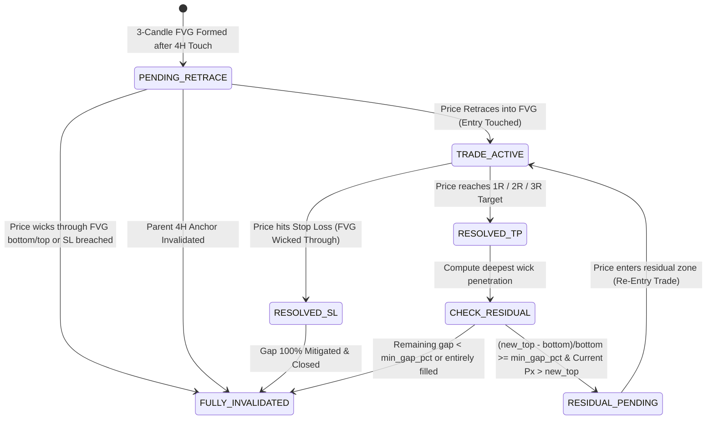

# Technical Design: LTF FVG Partial Mitigation & Dynamic Gap Reduction

## 1. Lifecycle State Transition Diagram



## 2. Dynamic Boundary Truncation Logic

### Bullish FVG
Given original boundaries `[bottom, top]` and deepest price dip `lowest_price_reached`:
- If `lowest_price_reached <= bottom`: FVG is **100% invalidated**.
- If `bottom < lowest_price_reached < top`:
  - `new_top = lowest_price_reached`
  - `residual_gap_pct = ((new_top - bottom) / bottom) * 100.0`
  - If `residual_gap_pct >= min_gap_pct`: FVG remains active with boundaries `[bottom, new_top]`.
  - Next trade entry price becomes `new_top`.
  - Stop Loss remains `min(C1.low, C2.low, C3.low)`.

### Bearish FVG
Given original boundaries `[bottom, top]` and highest price rally `highest_price_reached`:
- If `highest_price_reached >= top`: FVG is **100% invalidated**.
- If `bottom < highest_price_reached < top`:
  - `new_bottom = highest_price_reached`
  - `residual_gap_pct = ((top - new_bottom) / top) * 100.0`
  - If `residual_gap_pct >= min_gap_pct`: FVG remains active with boundaries `[new_bottom, top]`.
  - Next trade entry price becomes `new_bottom`.
  - Stop Loss remains `max(C1.high, C2.high, C3.high)`.

## 3. Data Structure Enhancements

In `strategy_extreme_fvg.py`:
```python
@dataclass
class FVG:
    direction: Literal["Bullish", "Bearish"]
    top: float
    bottom: float
    c1: Candle
    c2: Candle
    c3: Candle
    formed_at: int
    is_valid: bool = True
    timeframe: str = "4h"
    lifecycle_state: str = "PENDING_RETRACE"
    entry_timestamp: Optional[int] = None
    floating_r: float = 0.0
    # New fields for partial mitigation:
    original_top: float = field(default=0.0)
    original_bottom: float = field(default=0.0)
    mitigation_count: int = 0
    deepest_wick_penetration: Optional[float] = None
```
