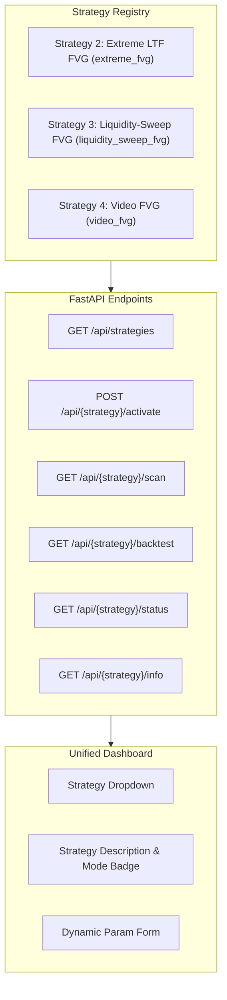

# OpenSpec Design: Merge develop and register Video FVG as Strategy 4

## System Architecture

The trading platform provides a pluggable strategy framework (`strategies/registry.py`) where strategies inherit from `BaseStrategy` (`strategies/base.py`) and declare self-contained defaults, setup finders, and backtesters:

### Strategy Registration Table
1. **Strategy 2 (`extreme_fvg`)**:
   - Class: `Strategy2Extreme` (`strategies/strategy2_extreme.py`)
   - Display: `Extreme LTF FVG`
   - Description: `4H Touched Anchor + Extreme LTF Outer Boundary + State Machine`
2. **Strategy 3 (`liquidity_sweep_fvg`)**:
   - Class: `Strategy3LiquiditySweepFVG` (`strategies/strategy3_liquidity_sweep.py`)
   - Display: `Liquidity-Sweep FVG`
   - Description: `4H FVG Bias + Liquidity Sweep Gate + LTF FVG Entry + Liquidity-First Target`
3. **Strategy 4 (`video_fvg`)**:
   - Class: `Strategy4VideoFVG` (`strategies/strategy4_video_fvg.py`)
   - Display: `Video FVG (4H Anchor)`
   - Description: `4H FVG Bias + HTF Respect Confirmation + First LTF FVG Entry + 3R Target`

### Invariant Guarantees
- `get_strategy("video_fvg")` resolves `Strategy4VideoFVG`.
- `list_strategy_names()` includes `["extreme_fvg", "liquidity_sweep_fvg", "video_fvg"]`.
- `GET /api/strategies` emits `name`, `display_name`, and `description` for all three strategies.
