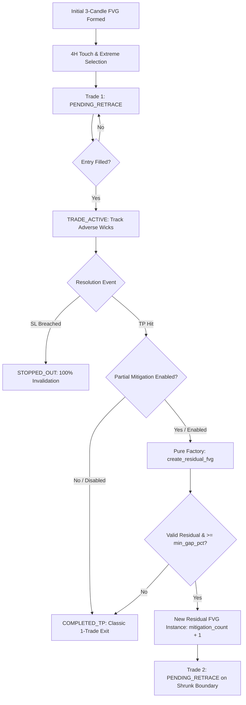

# Technical Design: Modular Residual FVG Engine

## 1. Modular Architecture Overview



## 2. Configuration & Modularity Layer

- **Environment Variable**: `EXTREME_PARTIAL_MITIGATION_ENABLED=true/false` (default: `true`)
- **App State**: `state["extreme_partial_mitigation_enabled"]`
- **REST API**:
  - `GET /api/extreme/config` $\to$ includes `"partial_mitigation_enabled"`
  - `POST /api/extreme/config?partial_mitigation=true/false` $\to$ dynamically toggles runtime behavior
- **Backtest CLI**: `--partial-mitigation` / `--no-partial-mitigation`

## 3. Pure Component Specifications

### 3.1 Pure Factory Function: `create_residual_fvg`
```python
def create_residual_fvg(
    fvg: FVG,
    deepest_wick: float,
    min_gap_pct: float = 0.05,
) -> Optional[FVG]:
```
- Pure function returning a new `FVG` instance.
- Preserves structural `c1, c2, c3` (invariant structural Stop Loss).
- Preserves `original_top, original_bottom, formed_at, timeframe`.
- Returns `None` if full breach or residual gap $< \text{min\_gap\_pct}$.

### 3.2 Immutable Lifecycle Evaluator: `evaluate_ltf_setup_lifecycle`
```python
def evaluate_ltf_setup_lifecycle(
    ltf_fvg: FVG,
    subsequent_candles: List[Candle],
    current_price: float = 0.0,
    completion_target: Literal["1R", "2R", "3R"] = "2R",
    min_gap_pct: float = 0.05,
    partial_mitigation: bool = True,
) -> Tuple[str, Optional[int], float, FVG]:
```
- Operates on immutable copies/scalars.
- Returns `(state, entry_ts, floating_r, resulting_fvg)`.

### 3.3 Backtester Integration: `backtest_extreme_fvg.py`
- Accepts `partial_mitigation: bool = True`.
- When enabled and TP is hit, computes `residual = create_residual_fvg(...)` and re-queues it for forward candles.
- When disabled, treats TP as final single-trade exit.

### 3.4 Live Trade Tracker: `extreme_trade_tracker.py`
- Accepts `partial_mitigation: Optional[bool] = None` (reads config/env).
- When enabled, calculates `residual_fvg` via `create_residual_fvg()` and saves in history.
- Handles pending setup replacements cleanly when `fvg_formed_at >= existing_formed`.
