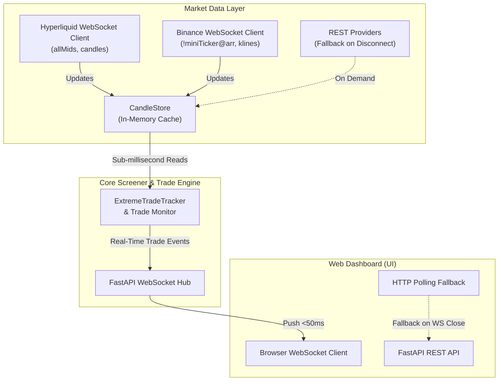

# Design: Real-Time WebSocket Streaming & Event-Driven Monitoring

## 1. Technical Architecture

## 2. Ingestion Protocol & Data Flows

### A. Hyperliquid WebSocket (`market_data/hyperliquid_ws.py`)
- Endpoint: `wss://api.hyperliquid.xyz/ws`
- Subscriptions:
  1. `{"method": "subscribe", "subscription": {"type": "allMids"}}`
     - Received: `{"channel": "allMids", "data": {"mids": {"BTC": "62100.5", ...}}}`
     - Ingestion: `candle_store.set_cached_mids("hyperliquid", mids)`
  2. `{"method": "subscribe", "subscription": {"type": "candle", "coin": "BTC", "interval": "5m"}}`
     - Received: `{"channel": "candle", "data": { "t": ..., "o": ..., "h": ..., "l": ..., "c": ..., "v": ... }}`
     - Ingestion: `candle_store.merge_candles("hyperliquid", symbol, interval, [candle])`

### B. Binance WebSocket (`market_data/binance_ws.py`)
- Endpoint: `wss://fstream.binance.com/ws/!miniTicker@arr`
- Ingestion: Parses 24-hr close prices into normalized symbols and updates `candle_store.set_cached_mids("binance_futures", mids)`.

### C. Reconnection & Resiliency Policy
- Keepalive ping/pong every 20-30 seconds to prevent silent connection drop.
- Automatic reconnect with exponential backoff (`1s, 2s, 4s, ... max 30s`) with random jitter.
- During any disconnection window, `CandleStore`'s `is_fresh()` checks will fail, triggering an instant, seamless fallback to existing REST fetch methods.

## 3. Dashboard Web UI Integration (`/ws/extreme-live`)
- FastAPI handles incoming WebSocket client connections via `@app.websocket("/ws/extreme-live")`.
- When trade ledger changes or periodic state ticks occur, the server broadcasts JSON messages:
  `{"type": "trade_update", "data": ...}` or `{"type": "scanner_status", "data": ...}`.
- Dashboard JavaScript connects via `new WebSocket(wsUrl)`.
- If the browser WebSocket drops, it cleanly falls back to 10s `fetchWithRetry` HTTP polling and attempts WS reconnection in the background.
